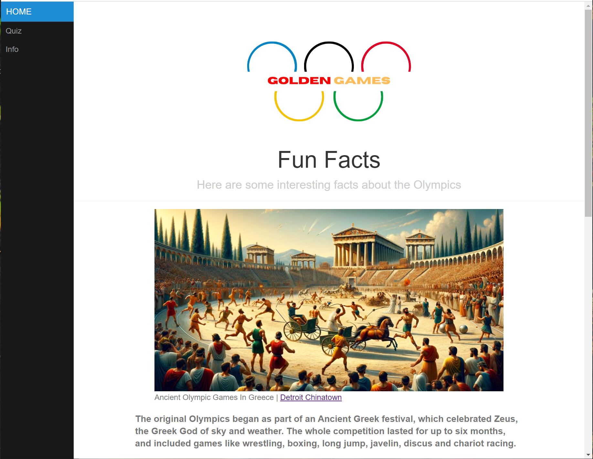
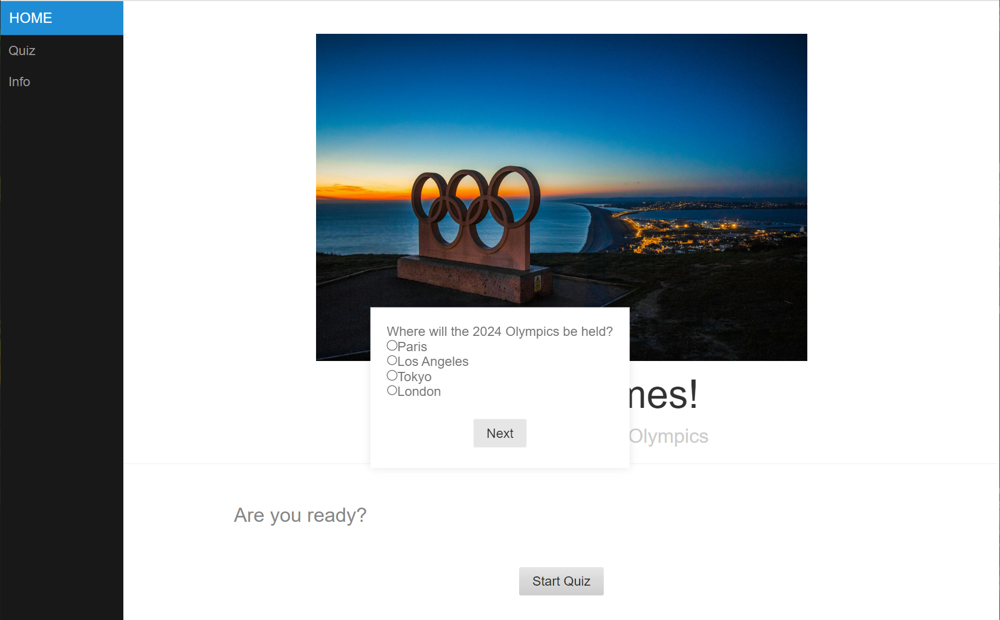
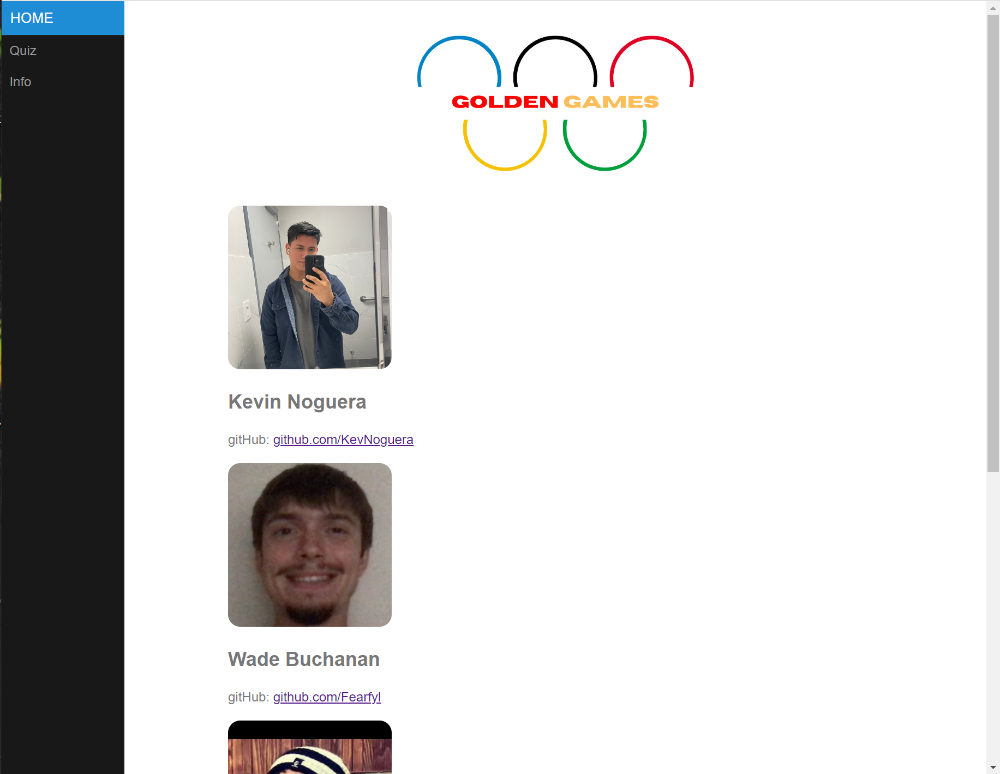

# Golden_games_repo
class project

## User Story
As a user, I want to take a quiz about the olympics and get a score based on the number of correct answers

## Elevator Pitch
"Think you know the Olympic Games? Put your knowledge to the test with our ultimate Olympic Trivia Quiz! From historic moments to record-breaking feats, this quiz will challenge your expertise on athletes, countries, and unforgettable performances that have shaped the world's greatest sporting event. Whether you're a casual fan or an Olympic enthusiast, our quiz offers fun facts and friendly competition. Get ready to relive the glory, learn something new, and see if you can claim the gold in the Golden Games!"

# Concept
## Description

A fun quiz game that tests your knowledge of Olympic sports history and gives a score based on the number of answers you answered correctly

## Motivation

We wanted to create a quiz that was geared around a current event for all people, so we chose the Olympics due to the recent summer Olympics and  the global inclusivity that the Olympics is known for

## Plans for Future Development

Updating HTML to include events that happen in future Olympics
Adding animations to add more life to the page
Adding more pages to include new quizzes and specific fun facts based on the Olympic sports

# Home page

# Quiz page

# Info Page

## Links
 https://docs.google.com/presentation/d/1QI9Zhus1sjq3EGEB752fUTvuv-yBBSeqW-TWw29S-ic/edit?usp=sharing
 https://pink727.github.io/Golden_games_repo/

## page layout
The Main CSS style file is from PureCSS
https://purecss.io/layouts/side-menu/#home

## Credits
Kevin: CSS, HTML 
Dee: JS, HTML 
Avi: CSS, HTML 
Wade: HTML, JS
